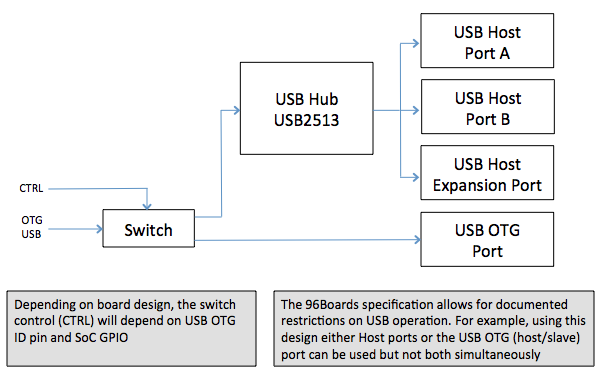
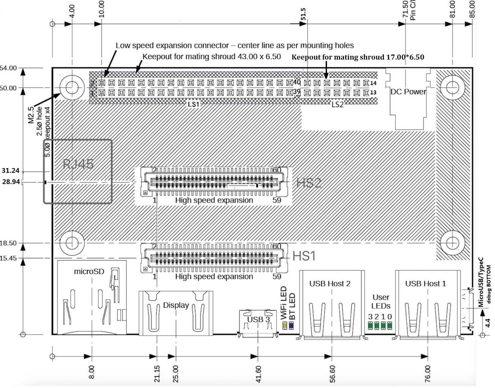
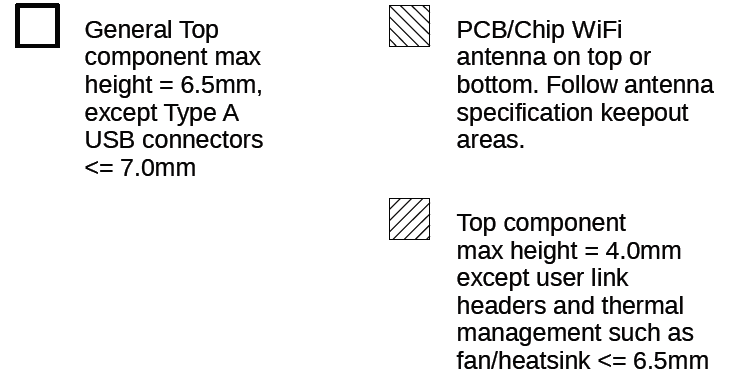
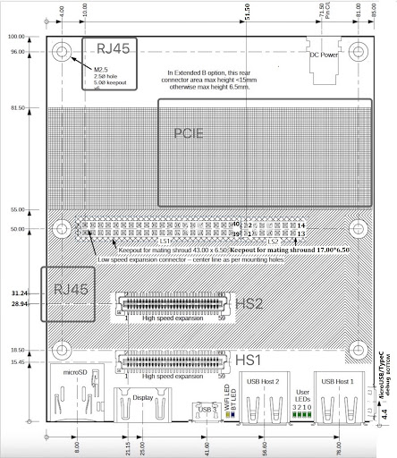
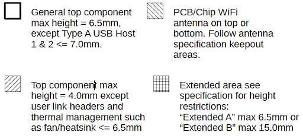

.. SPDX-License-Identifier: CC-BY-SA-4.0

IMPORTANT INFORMATION
=====================
© Copyright 2021 Linaro Ltd. All rights reserved.
This document is copyrighted by Linaro Ltd. Permission is granted to reproduce and distribute this document in its entirety and without modification.

NOTICE
******

The 96Boards Consumer Edition Specification is authored by the 96Boards. The intent of the 96Boards is for the 96Boards Specification to be an open industry standard supported by a wide variety of vendors and products. Vendors and users who are interested in developing 96Boards-compatible products or services, as well as parties who are interested in joining the 96Boards to further promote 96Boards as an open industry standard are invited to email support@96Boards.org for further information.

The 96Boards wants to receive your comments on this specification. Visit the 96Boards website at https://www.96boards.org for contact information and to learn more.

The attention of adopters is directed to the possibility that compliance with or adoption of the 96Boards specifications may require use of an invention covered by patent rights. Linaro shall not be responsible for identifying patents for which a license may be required by any 96Boards specification, or for conducting legal inquiries into the legal validity or scope of those patents that are brought to its attention. 96Boards specifications are prospective and advisory only. Prospective users are responsible for protecting themselves against liability for infringement of patents.

The information contained in this document is subject to change without notice. The material in this document details a 96Boards specification in accordance with the license and notices set forth on this page. This document does not represent a commitment to implement any portion of this specification in any company’s products.

Linaro makes no warranty of any kind with regard to this material, including, but not limited to,the implied warranties of merchantability and fitness for a particular purpose. Linaro shall not be liable for errors contained herein or for incidental or consequential damages in connection with the furnishing, performance, or use of this material.

Compliance with this specification does not absolve manufacturers of 96Boards equipment from the requirements of safety and regulatory agencies (UL, CSA, FCC, IEC, etc.).

Trademarks
**********

Linaro™ and 96Boards™ are trademarks of Linaro Ltd.
For further information contact: support@96Boards.org

Background
==========

The 96Boards Consumer Edition (CE) Platform is intended to support:

   1: Low cost Single Board Computer use
      - Low cost platform for running standard Linux-based OS including Android
   
   2: Open Source community software development.

   3: Maker community
      - Requiring extensible hardware interfaces to prototype or build add on products.
   4: Embedded System OEMs requiring low cost off-the-shelf CPU modules.
      - Example - Kiosks, Displays, Robots etc.
   5:Community engineering activities, including
      - Upstream development
      - Allowing ‘real life’ benchmarking and tuning, including power management
      - Integration into an automated test farm
      - 96Boards Community program to be run by Linaro

In all cases key design and distribution goals are:
   - Low cost (target of $50-100 retail for a minimum configuration)
   - Easy to extend with off the shelf parts available to maker community and OEMs
   - Easy to purchase globally (for example, via Amazon, Alibaba, Farnell, Digikey,Mouser etc.)
   - Enable a third party ecosystem to develop around expansion (mezzanine)boards/peripherals/displays etc. that can be used on any 96Boards CE compliant board

A key design objective is to encourage multiple SoC vendors to build boards to this specification. This is an evolution from previous successful community boards where the external ecosystem is tied to a particular SoC. The 96Boards CE specification is designed to enable an ecosystem to evolve that will support multiple SoCs over a period of years.

The specification is completely open - that is anyone may build a board to the specification without payment of any fees or any licensing requirements.

The 96Boards CE Certification Program is optional for board developers and will provide hardware and software certification, a community site and software support provided byLinaro for 96Boards CE certified boards. Participation is not required in order to build a board to the specification.

96Boards Branding
*****************

Boards that are expected to be certified by 96Boards shall display approved branding on the board silk screen or copper.

96Boards Consumer Edition v2.0
==============================

Hardware
********

**96Boards CE Minimum Hardware Features**
   1: Ultra-small low-profile “card” form factor - 85 x 54 x 12mm
      - Footprint compatible Extended Version option - 85 x 100 x 12mm
   
   2: Design is SoC independent (targets 32 or 64 bit SoCs)

   3: 0.5GB RAM (Minimum 4GB recommended for Android)

   4: MicroSDHC Socket for up to 64GB on-board or expansion flash storage

   5: Wifi 802.11g/n and Bluetooth 4.0 LE

   6: On Board Connectors and expansion I/O
      - 2x USB Type A or Type C host ports (USB2.x or 3.x)
      - USB Type C slave
      - Display output shall available on one of the following:
         - HDMI/audio on HDMI full size or micro connector
         - MHL display/audio on display microUSB
         - DisplayPort /MHL display /audio on USB Type C
      - Low profile 40 way female header for maker/community use
      - Low profile 60 way high speed female module header for advanced maker/OEM use with high speed interfaces including MIPI-DSI, USB and optional MIPI CSI-2
      - Board power from low profile DC Jack connector

A 96Boards CE board shall implement the minimum functionality. Additional functionality may be implemented provided that the 96Boards CE specifications are implemented in full (including limitations on form factor).  See below for further information.

Hardware Feature Details
************************

**96Boards CE Physical Footprint**

The 96Boards CE defines a new standard for small footprint community boards. The board is defined into a credit card footprint with a total maximum height of 12.0mm:
   1: Area
      - The board without a population of connectors shall fit into a 85 x 54mm footprint +/-0.25mm. Connectors should not protrude from the area footprint except as component design requires (for example USB Type A front shrouds).
      - A compatible extended version is defined that shall fit into a 85 x 100mm footprint with the same conditions. 

   2: Height
      - PCB		62mil (1.575mm) nominal
      - Below PCB	3.4 mm maximum
      - Above PCB	7.0 mm maximum

Total height of the board including on board connectors shall not exceed 12mm. 

Note that the maximum height for general components on the board top side is 4mm (not including the allowed areas for connectors and larger components). The maximum height in the allowed areas is 6.5mm except for the two Type A USB connectors which can be up to 7.5mm. The extended version allows some components to exceed the height specifications. See the keepout drawings in the Specification Appendix for further information.

**SoC**

The SoCs shall have Minimum 2 cores such as Cortex A7/A9/A53/A35/A55/A72/A73/A77/A78 or above, and  GPU such as Imagination PowerVR , ARM Mali GPU or Qualcomm Adreno etc.

The built-in  NPU/TPU/AI accelerator is optional. It is also optional to use external chips or modules through SDIO/USB/PCIe interfaces.

The Boards shall have Video and Image decoding / encoding capability. The Built-in DSP is optional for Voice processing. It is optional to use external DSPs through Mezzanine Boards.

**SoC Location Options**

The specification is designed with two possible locations for the SoC. One is on the board top surface, and the other is on the board bottom surface. 

The rationale is to permit SoCs with low power dissipation to be placed on the top surface with a low profile heatsink or fan if required (to a total maximum height of 6.0mm). Then, mezzanine boards placed above this area are required to have no components on their underside corresponding to the keep out area above the SoC. 

The second option is to place the SoC on the underside of the board. This is intended for implementations that require higher SoC power dissipation. As supplied, the board should meet the “below PCB” footprint requirement. This then allows additional thermal management in the case or enclosure for the board as required.  

**DRAM**

The board shall be populated with a minimum of 0.5GB of DRAM. 

It is strongly recommended that a minimum of 4GB DRAM is fitted where the board is expected to run Android. 

**eMMC/Flash**

The board may optionally be populated with eMMC or other format flash memory. 

It is recommended to use a SPI FLASH for  the bootloader.

If the SoC used is not able to boot from microSDHC then a minimum of 8MB of bootable flash memory shall be provided on the board. 

Where multiple boot options are provided the choice of boot location shall be user selectable in hardware (links or switches). 

Note that the insertion of a cable shall not automatically require boot from that cable (for example the insertion of a microUSB cable into an OTG port to use FastBoot). In this case the boot option must still be user selectable.

**microSDHC**

A microSDHC card socket shall be fitted in the specified location on the board. 

In the absence of on-board Flash memory, the system shall be capable of booting from the boot software installed on a microSDHC card at power up. 

**WiFi/Bluetooth LE**

The board shall support WiFi (minimally 802.11g/n) and Bluetooth 4.0 (Bluetooth Low Energy). 

It is highly recommended that WiFi 802.11ac or 802.11ax@2.4G/5G and Bluetooth5.0/5.1 are also supported.

A PCB or chip antenna shall be provided in the prescribed location. 

An external antenna socket option is recommended be provided for better antenna performance.

**Display Interface**

Display output shall be one of:
   1: HDMI which shall be provided on a full size (Type A) or a micro Type D connector 
   2: MHL which shall be provided on a 5 pin microUSB connector 
   3: Displayport which shall be provided on a USB Type C connector 

In all cases the display interface shall include audio with support for at least 1 channel

In all cases the connector shall be located in the specified location. 

A MIPI DSI port shall be provided on the expansion bus interface. 
1-4 lanes are supported. An implementation may use less than 4 lanes. 

Note that if a single DSI interface on the SoC is used to provide both (1) the high speed expansion bus interface DSI port and (2) the on board HDMI/MHL/DisplayPort interface (via suitable transmitter), then the expansion port interface shall be operational if a mezzanine board that uses DSI is fitted. It is then optional as to whether the on-board interface is usable at the same time. 

**Camera Interfaces**

HS1 connector
   - 1 or 2 MIPI CSI-2 ports may be provided on the expansion bus interface. 
   - If 1 port is provided it shall be located on the CSI0 port interface
   - From 1-4 lanes may be implemented on the CSI0 port interface
   - From 1-2 lanes may be implemented on the CSI1 port interface

   An implementation may support dual (stereo) cameras through the CSI0 interface if the SoC provides the necessary functionality. 

   Cameras/Sensors can require additional control signals including RST, PWRDN and MCLK.

   The specified GPIO and CLK signals on the expansion connectors shall be used for these functions if implemented. 

   If the cameras/sensors are not available/used then these signals shall be available as GPIO and CLK signals. 

HS2 connector
   - 1 or 2 MIPI CSI-2 ports may be provided on the expansion bus interface. 
   - From 1-4 lanes may be implemented on the CSI2 port interface
   - From 1-4 lanes may be implemented on the CSI3 port interface

   Cameras/Sensors can require additional control signals including RST, PWRDN and MCLK.

   The specified GPIO and CLK signals on the expansion connectors shall be used for these functions if implemented. 

**USB Ports**

A total of 5 USB ports shall be provided for a board. 

Two Type A or Type C USB host ports (USB 2.x or 3.x) shall be provided on the board. 

The connectors shall be in the specified locations. 

A Type C USB port shall be provided as the third USB port. USB 3.1 is strongly recommended, with power Delivery 2.0 v1.3 optional for new designs.
   - This port shall be capable of slave operation.
   - This port may also be used to provide 5V external power to the board.
   - The connector shall be placed in the specified location. 
   - The third port may be an OTG port.  

A fourth USB host port shall be provided on the high speed expansion bus. 

Implementation note: some mobile SoCs implement only a single USB OTG port. Such SoCs can be used on boards with a switch and a USB hub IC. See the Appendix to this specification for an example implementation.  

Therefore, there may be some restrictions on simultaneous USB port usage.

Two examples:
   - It may not be possible to use the host ports simultaneously with the slave port
   - A base board port may be shared via a switch to provide the expansion port

Any such restrictions shall be clearly documented.

A fifth UART with microUSB/USB-C physical interface is strongly recommended for debugging (Bottom side).

The connector should be in the specified location if supported.

**Audio**

The board shall provide a minimum of single channel audio through the following facilities:
   1: I/O via Bluetooth 4.0
   2: Output through the HDMI/MHL/DisplayPort interface

An I2S/PCM audio channel shall be provided on the low speed expansion interface.

The  Analog Audio ports interfaces(Speaker/MIC/Headset) on LS2 connector are optional.

**DC Power**

Power shall be provided to the board by one (and only one) of the following:
   1: An 8V to 18V power supply from a dedicated DC jack power connector.
      - A 1.65mm center pin positive DC jack connector, CUI Inc PJ-041H or equivalent, shall be placed in the specified location. For the extension version, it is recommended to use a larger size DC jack connector with  2.5mm Inside Contact Diameter and 5.5mm Outside Contact Diameter  for low cost and supplier(PJ-063BH/DC-0146 etc)

   2: An 8V to 18V power supply from the SYS_DCIN pins on the low speed expansion connector LS1 and LS2.
   3: A USB Type C port at 5V ( if fitted,PD is optional) according to the USB 3.1 specifications. 

The specification does not support multiple simultaneous power supplies (ie DC jack, mezzanine board power, USB power). If multiple in-specification supplies are connected there shall not be a safety issue and there shall be no damage to the board. 

The board shall be able to provide the following power to external devices when a sufficiently rated power supply is connected to the DC Jack:
   1: A minimum of 7W to a mezzanine module via the SYS_DCIN line on LS1, and 
   2: A minimum of 5W to a mezzanine module via the regulated +5V line on LS1, and 
   3: A minimum of 5W each to external USB devices connected to the 2 host USB ports, and
   4: A minimum of 0.18W to a mezzanine module via the regulated +1.8V line
   5: A minimum of 7W to a mezzanine module via the SYS_DCIN2 line on LS2, and 
   6: A minimum of 5W to a mezzanine module via the regulated +5V line on LS2

The board shall be able to provide the following power to external devices when powered from (a) the Expansion connector or from (b) a Type C USB port (when power does not have to be provided on the SYS_DCIN line)
   1: A minimum of 5W to a mezzanine module via the regulated +5V line, and 
   2: A minimum of 5W each to external USB devices connected to the 2 host USB ports, and
   3: A minimum of 0.18W to a mezzanine module via the regulated +1.8V line

**Battery Power and Low Cost Power Supplies**

A board could be powered either by a low cost power supply that is only capable of providing power for the board and for low power mezzanine boards, or by an external battery (for example from the SYS_DCIN line or a separate battery connection).

Limitations on available power covering the use of smaller and/or battery power supplies shall be clearly documented.

**Measurement, Instrumentation and Testing Facilities**

Boards shall support power measurement, instrumentation and testing facilities. The following facilities shall be provided.

**Power Measurement**

A minimum of 1 current sense resistor shall be placed to permit basic power measurement functions. 
   1: The total power consumption of the board shall be measurable through a suitable 1% current sense resistor. 
   2: This may be a developer install option (i.e. the sense resistor may be shipped as a zero ohm resistor for production boards that a developer can replace for power measurement)
   3: The sense resistor shall be placed on the main board power supply to measure the total baseboard power. It is optional as to whether this will measure any mezzanine board power usage. 

Additional current sense resistors may be placed at the discretion of the board designer.

It is recommended that additional sense resistors are provided for the main PMIC downstream supplies to the SoC core, memory etc.

Current sense resistors shall be made available externally to measurement equipment. One option for interface is the ARM Energy Probe:

http://ds.arm.com/ds-5/optimize/arm-energy-probe/ 

The PCB design shall provide for low profile male 0.1” header pins to enable the connection of:
   1: The sense resistor connections (2 pins each)
   2: A single ground pin (for voltage measurement). The Low speed expansion connector may be documented as being usable for the ground pin requirement. 

This header (or headers) may be unpopulated on a retail 96Boards CE board (enabling users to add the headers themselves). 

**Power Button and Reset Button**

The user shall be able to manually power up/down and hard reset the board. 
(For example, with one or two button switches). 

It shall be possible to connect external switches for power on/off and for hard reset. 

This shall be implemented using the specified pins on the low speed bus connector (adjacent pins allowing direct connection of a 3 pin connector for both switches). 

It shall be possible to configure the board to power up automatically if external power is removed and then re-applied. 

This may either be a default operation or through a configuration option (e.g. link or switch). 

Implementation note: Reset refers to hard reset (aka. power-on reset) of the board, not to reset the board to factory software image in this context. It is up to the designer how to implement this functionality. For example, a single push button under SoC/PMIC control could be used to turn the power on or off, with a long press to carry out a system reset. In this case the board should automatically always power up when power is newly applied. Alternatively a physical On/Off toggle switch could be used to apply power to the board, which would automatically power up when in the On position. In this case a separate push to reset switch could be implemented. 

**External Fan Connection**

An external fan (for example for a case) connection is available on the low speed expansion connector by using a 2 pin male header for +5V or +12V fans. 

**UART**

General Purpose

One standard UART from the SoC shall be made available for general purpose use on the low speed expansion connector. 

Debug Console

A second UART (TxD/RxD only) may be made available on the low speed expansion connector.

**MicroUSB/TypeC debug port**

One USB to UART bridge microUSB/USB-C interface is strongly recommended to be implemented. If it is then the USB to UART device shall be powered when an external cable is connected (even if the board is not powered). 

If it is implemented, the connectors shall be in the specified locations(on the bottom side).

These will serve as the debug console. (the second UART on LS and MicroUSB debug port can be switched if only one UART port)

Note: Off the shelf 1.8V serial USB cables may be used to connect to these interfaces. 

**JTAG**

JTAG facilities may be provided on a board.

If implemented the JTAG interface shall use the 10 pin JTAG connector (0.05” pitch)

Please pay attention that if the JTAG connector height exceeds the CE specifications, it may conflict with the Mezzanine boards to plug in(if mounted on the top side), and this should be avoided,the MP vendor can leave the JTAG connector open and provide the connector component to customer to sold.

http://www2.keil.com/coresight/coresight-connectors/#10pin

https://www.samtec.com/standards/jtag

**System and User LEDs**

The following LEDs shall be present on the board. 

The LEDs shall be of the specified size, color and location as specified in the 2D Drawings in the Appendix.  

The User LEDs shall be directly programmable from the SoC. 
   1: WiFi activity LED		Yellow	Type: 0603 SMD
   2: Bluetooth activity LED	Blue	Type: 0603 SMD
   3: User LEDs x4			Green	Type: 0603 SMD

Other LEDs and UI interfaces are optional.

**Front Panel and DC Jack Connectors**

Development boards are in general subject to high cycle life of connector attachments, and should be designed to be as mechanically strong as possible. Therefore, the front panel connectors (Display, USB Type A and microUSB/USB Type C) and the DC Jack connector shall include through-PCB mechanical support. 

While surface mount electrical connections are acceptable, a fully surface mount connector without any in/through board mechanical support shall not be used. 

**RJ45**

It is recommended to implement at least one RJ45 Ethernet port.

If implemented, the RJ45 connector shall be in the specified location. The RJ45 connector on the  CE standard  shall use sink-type to be compatible with height restriction.

**PCIe**

It is recommended to implement at least one PCIe.

One  2 lane PCIe is specified on the HS2 connector. If supported, it shall follow the pins definitions.

**Expansion Connectors**

Two expansion connectors shall be provided. The first is a low speed expansion connector LS1 carrying GPIO and other low speed interfaces. The second is a high speed expansion connector HS1 that provides high speed interfaces such as MIPI DSI, MIPI CSI-2 and MIPI-HSIC.

Another two expansion connectors are optional for high end platforms. The 3rd  is low speed expansion connector LS2 carrying GPIO, Analog Audio (speaker/Microphone/Earphone and headset),The 4th is a higher speed expansion connector HS2 that provides high speed interfaces such as PCIe,MIPI CSI-2* 2ports(one CSI-2 is mux with eDP/DSI/LVDS) and USB3.0 .

If supported,  the pin definitions and locations shall follow the specifications.

Mezzanine boards are expected to be used in one of below configurations:
   1: Low speed expansion connector only(LS1)
   2: Low and high speed expansion connectors together(LS1 and HS1)
   3: Low and high speed expansion connectors together(LS1/LS2 and HS1/HS2)

**Low Speed Expansion Connector LS1**

A 40 pin low profile female 2mm receptacle (20x2) 4.5mm height is specified. This shall be implemented.

Part numbers include:
   - Molex 87381-4063		(SMT)
   - FCI 55510-140LF		(SMT)
   - Samtec TLE-120-01-G-DV	(SMT)
   - TE 4-1470209-3		(Through hole)
   - TE 4-1734506-3		(Through hole)
   - FCI 63453-140LF   		(Through hole)
   - TE 4-2314821-0(0.38um gold plate)
   - TE 4-2314822-0(0.76um gold plate)

Important notes: 
   1: Unless otherwise indicated the low speed expansion connector signals are at 1.8V logic levels. 
   2: The mezzanine board connector may be shrouded or unshrouded (see example part numbers below). Since a shrouded part can be used the connector footprint should be 43.0x6.5mm with no other components on the board top side in this area. 

The following interfaces shall be available except where specified as optional:
   - UART0		(General purpose)
   - UART1		(Debug console)
   - SPI bus
   - I2C x2
   - I2S 
   - GPIO x12
   - Reset and Power button
   - 1.8V, 5V and DC_IN power supplies

   Refer to Connector Pin Specification appendix for the required pinout. 

**Low Speed Expansion Connector LS2**

A 14 pin low profile female 2mm receptacle (7x2) 4.5mm height is specified. This is optional.

Part numbers include:
   - Molex 87381-1463 (SMT)
   - FCI 55510-114LF (SMT)
   - FCI 63453-114LF (Through hole)
   - TE 1-2314821-4 (Through hole)
   - TE 1-2314822-4 (Through hole)

Important notes: 
   1: Unless otherwise indicated the low speed expansion connector signals are at 1.8V logic levels. 
   2: The mezzanine board connector may be shrouded or unshrouded (see example part numbers below). Since a shrouded part can be used the connector footprint should be 18.0x6.5mm with no other components on the board top side in this area. 

The following  interfaces shall be available except where specified as optional:
   - 5V and DC_IN power supplies
   - Analog Audio: MIC/Speaker/Headset

   Refer to Connector Pin Specification appendix for the required pinout. 

**High Speed Expansion Connector - HS1**

A 60 pin 0.8mm high speed Board to Board low profile receptacle connector is specified. This shall be implemented.

Part numbers include 
   - FCI 61082-061409LF
   - TE 5177983-2

Important note: unless otherwise indicated the high speed expansion connector signals are at 1.8V logic levels. 

The following interfaces shall be available except where specified as optional:
   - MIPI DSI
   - USB
   - SD or SPI interface
   - MIPI CSI-2 (x2 optional)
   - I2C (x2 optional, but 1 shall be provided if CSI interface(s) are provided)
   - HSIC (optional)

   Refer to appendix for the required pinout. These connectors have been designed to provide a board to board separation to a mezzanine board of 8.0mm. 

**High Speed Expansion Connector - HS2**

A 60 pin 0.8mm high speed Board to Board low profile receptacle connector is specified. This is optional.

Part numbers include 
   - FCI 61082-061409LF
   - TE 5177983-2

Important note: unless otherwise indicated the high speed expansion connector signals are at 1.8V logic levels. 

The following interfaces shall be available except where specified as optional:
   - PCIe*2
   - USB3.0
   - CSI-2*2 ports ( x4 Lanes optional),the CSI3-2 is mux with eDP/LVDS/DSI port
   - SPI(mux with I2C3/4 and TP signal)

   Refer to appendix for the required pinout. These connectors have been designed to provide a board to board separation to a mezzanine board of 8.0mm.

**Expansion Board Connectors**

The following mezzanine board connectors may be used to interface to the baseboard:
   - MOLEX 87831-4029: Low speed 2.5mm mated height (Through hole shrouded)	
   - FCI 57202-G52-20LF: Low speed 2.5mm mated height (SMT no shroud)
   - SAMTEC TMMH-120-01-F: Low speed 2.0mm body (Through hole)
   - FCI  61083-063400LF: High speed
   - TE 5179030-2: High speed
   
**Expansion Connector Notes**

1: GPIO-A shall be capable of waking up the SoC from sleep/standby mode

2: By default all GPIO pins should be configured at boot as inputs to the SoC. This allows for the mezzanine board configuration to be detected from the SoC. After the configuration is known GPIO pins (pin-muxed) may be re-configured in software for mezzanine module specific functions. Through this mechanism additional support for particular SoC/mezzanine module configurations may be supported by making the appropriate SoC GPIO special function pins available on the expansion connector(s). Note that by default all GPIO pins should be usable as GPIOs (i.e. any generic mezzanine board may rely on any or all of the specified GPIO pins being available for use).

3: A mezzanine board should not place components (other than the required connectors) on the underside in the area of the base board.
   
Functionality Requirements
==========================

Standalone Functionality
************************

The standalone board requires only a power supply and display connected to be used as an advanced single board computer (using wireless keyboard/mouse/WiFi & Bluetooth). 

Maker Functionality
*******************

The hobby/maker community are able to use the low speed connector directly, but must be aware that the connections could be direct 1.8V level to the on-board SoC.

Embedded OEM Functionality
**************************

It is intended that embedded equipment makers can easily create mezzanine boards that connect to the high speed and low speed connectors to create small form factor, low profile embedded products. An example would be a LCD panel interface with touch screen and optional keys/keyboard. Such boards will connect to any 96Boards CE compliant board. 

Additional Functionality
************************

Boards that comply with the 96Boards CE spec may provide additional functionality provided that all mandatory functionality is available. 

For example a 96Boards CE board could optionally provide facilities such as:
   - Additional custom storage
   - Additional I/O - e.g. Ethernet, etc.
   - On board external battery power/charging support for mobile applications
   - PCIe interface(s) using PCIe mini or M.2 connectors mounted on the extended version or on the board underside, the PCIe or M.2 connector shall be in the specified location.

Any included additional functionality, headers, mezzanine or board to board connectors shall not contravene the 96Boards CE Physical Footprint specification (including height), or prevent the use of the 96Boards CE low speed or high speed connector expansion facilities.

96Boards Consumer Edition Software Requirements
===============================================

License Compliance
******************

All the sources required to rebuild the image shall be downloadable via public git repositories where the license (e.g. GPL) requires it.

Hardware Enablement
*******************

It shall be possible for the user to replace or update the firmware, bootloader, kernel and rootfs on the board without the need for specialised additional hardware.

It shall be possible to recover from a “bricked” board (for example as a result of use of a user built bootloader) without specialized additional hardware.

Core Functionality
******************

The bundled software shall enable all mandatory HW specified in the 96Boards specification e.g. USB, Display, Connectivity, Serial, on-board switches and LEDs, various mandatory interfaces on the LS and HS connectors

Software for Certified boards
*****************************

Linaro will provide an open ‘community portal’ for 96Boards Certified products where users may go for support and software upgrades.

Software for Certified Reference boards
***************************************

Unless otherwise stated, support means:
   - Support in the relevant project’s repositories, for example the Linux kernel git repositories at git.kernel.org
   - Source and binary code packages available to download

Minimum Software requirements for 96Boards Reference certification will include:
   -  Boot architecture (open source implementations are strongly recommended)
      - Support for bootloader such as U-Boot/FDT, UEFI/ACPI, UEFI/FDT
      - Support for a secure execution environment (optional)
      - Support for ARM Trusted Firmware (ARMv8), including PSCI APIs (optional)

   - Accelerated graphics support
      - Accelerated graphics drivers need to be fully supported either with open source code, or through royalty free binary drivers. If binary drivers are utilized, the vendor will provide support to provide updated drivers/libraries to support new mainline Linux kernel features. 
   - Kernel
      - A kernel based on one of the following that is buildable from source code and any required binary blobs:
         - kernel.org latest “mainline” or “stable” kernel
         - The latest Google-supported Android kernel version
         - One of the last two kernel.org LTS kernels (for example Linaro LSK)
   - Operating system
      - The latest released (stable) version of one or more of the following open source distributions shall be made available for a 96Boards CE compliant design:
         - Android
         - Debian or Ubuntu
         - Fedora or Red Hat
         - An OpenEmbedded/Yocto build of a Linux distribution
   - Other Operating Systems/Distributions
         - Other operating systems or distributions may be provided for a 96Boards product and can be made available to end users on the 96Boards community portal

References
==========

1: CSI - http://mipi.org/specifications/camera-interface

2: SPI - http://en.wikipedia.org/wiki/Serial_Peripheral_Interface_Bus

3: DSI - http://mipi.org/specifications/display-interface

4: MHL - http://www.mhlconsortium.org

5: DisplayPort - http://www.displayport.org

6: microSDHC - http://en.wikipedia.org/wiki/Secure_Digital

7: USB Type -C - http://www.usb.org/developers/usbtypec/

Appendix
========

Expansion Connector Signal Description
**************************************

**40 Pin Low Speed Expansion Connector LS1**

.. csv-table:: LS1 2x20 Female 2mm Header
   :file: ./cev2table-ls1.csv
   :header-rows: 1

**14 Pin Low Speed Expansion Connector LS2**

The LS2 is to provide additional power for LS1 and provide CAN and  Audio (Analog Audio output for those  platforms that have integrated Codec or using LS1 I2S for external Codec in the mezzanine board). 2x7 female 2mm header is defined as below:

.. csv-table:: LS1 2x7 Female 2mm Header
   :file: ./cev2table-ls2.csv
   :header-rows: 1

**60 Pin High Speed Expansion Connector HS1**

0.8mm 50 ohm high speed receptacle

.. csv-table:: HS1
   :file: ./cev2table-hs1.csv
   :header-rows: 1

**60 Pin High Speed Expansion Connector HS2**

The HS2 interface is to provide 2* CSI-2 4lanes interfaces, 2Lanes PCIe and USB3.0 for high end platforms, this is optional. The USB3.0 signal consists of  HS1’s Pin 51 and Pin53 (HS signal )and HS2’s Pin 52/54/56/58 (SS signal). 

0.8mm 50 ohm high speed receptacle.

.. csv-table:: HS3
   :file: ./cev2table-hs2.csv
   :header-rows: 1

Pin Discretion
**************

**UART**

One UART shall be provided on the low speed expansion bus. A second UART may be provided

.. csv-table:: UART
   :file: ./pin-desc-uart.csv
   :header-rows: 1

**I2C**
Two I2C interfaces shall be provided on the low speed expansion bus

.. csv-table:: I2C
   :file: ./pin-desc-i2c.csv
   :header-rows: 1

It is recommended that a 2K2R pullup is provided on each I2C signal, dependent on any relevant drive/pullup specifications of the SoC. 

**Power and Reset**

The following controls shall be provided on the low speed expansion bus

.. csv-table:: Power and Reset
   :file: ./pin-desc-pwr-rst.csv
   :header-rows: 1

These signals  shall be active low.

**SPI**

One SPI bus master shall be provided on the low speed expansion bus.

.. csv-table:: SPI
   :file: ./pin-desc-spi.csv
   :header-rows: 1

**PCM/I2S**

One PCM/Inter IC Sound (I2S) PCM audio data bus shall be provided on the low speed expansion bus.

.. csv-table:: PCM/I2S
   :file: ./pin-desc-pcm-i2s.csv
   :header-rows: 1

**GPIO**

12 GPIO lines shall be provided on the low speed expansion bus

.. csv-table:: GPIO
   :file: ./pin-desc-gpio.csv
   :header-rows: 1

**GPIO Special Functions**

GPIO-A shall be capable of waking up the SoC from sleep. 

The following pins shall have alternate functions for DSI/CSI control if required by the display/sensor

.. csv-table:: GPIO Special Functions
   :file: ./pin-desc-gpio-spl.csv
   :header-rows: 1

**Power Supplies**
The following power supplies shall be provided on the low speed expansion bus

.. csv-table:: Power Supplies
   :file: ./pin-desc-power.csv
   :header-rows: 1

See the DC Power section of the 96Boards Specification. 

**MIPI-DSI**
A MIPI DSI interface shall be provided on the high speed expansion bus.

.. csv-table:: MIPI-DSI
   :file: ./pin-desc-mipi-dsi.csv
   :header-rows: 1

**MIPI-CSI2**

Two MIPI-CSI2 interfaces may be provided on the high speed expansion bus.

.. csv-table:: MIPI-CSI2
   :file: ./pin-desc-mipi-csi2.csv
   :header-rows: 1

**HSIC**

One MIPI-HSIC interface may be provided on the high speed expansion bus. 

.. csv-table:: MIPI-HSIC
   :file: ./pin-desc-mipi-hsic.csv
   :header-rows: 1

**RESERVED**

One pin shall be reserved for future use. It shall be pulled up via 100K to 1.8V. 

.. csv-table:: Reserved
   :file: ./pin-desc-reserved.csv
   :header-rows: 1

**SD/SPI**

The expansion port shall be configured with either an SD port or a second SPI Port 

.. csv-table:: SD-SPI
   :file: ./pin-desc-sd-spi.csv
   :header-rows: 1

**CLOCKS**

One or two programmable clock interfaces may be provided on the high speed expansion bus. 

If CSI camera(s) are supported on mezzanine boards these clocks shall be available as the CSI reference clocks (in case they are needed)

.. csv-table:: CLOCKS
   :file: ./pin-desc-sd-clk.csv
   :header-rows: 1

**USB**

One USB host port shall be provided on the high speed expansion bus. 

In many designs the USB port is expected to come from a USB hub solution ready for direct connect to a USB interface, therefore these signals are specified at USB PHY signal levels.

.. csv-table:: USB
   :file: ./pin-desc-sd-usb.csv
   :header-rows: 1

Single USB port Example
***********************

On cost-sensitive SoCs targeted at the mobile market there may only be a single USB 2.x/3.x port on the device. A typical 96Boards USB implementation needs to implement a USB hub for this situation. This can be achieved in a number of ways. One example is as follows:

2D Reference Drawings
=====================

96Boards Consumer Edition V2.0 Standard Edition
***********************************************

96Boards Consumer Edition V2.0 Extended Edition
***********************************************

The Consumer Edition Extended Version is for those SoCs that require additional space (typically because of the need for additional memory devices or other required feature sets). The Extended Version is footprint compatible with the standard version.
Board designers have a choice for the extended area (shown in green and top white above)

**Either:**
   Extended A
      - The extended area shall conform to the 4mm (except for user links and thermal management) rules as specified for the main area of the standard board. The extended rear connector area shall conform to the 6.5mm maximum height. This ensures that the design will work with all 96Boards program Mezzanine Boards.

**OR**
   Extended B
      - The extended area and the extended rear connector area shall use components that extend to a maximum of 15.0mm above the board surface. Designers that choose this option have more flexibility in board design for SoC, component and connector positioning in the extended area, but Large Mezzanine Boards or Modules (see below) may not be compatible with the board design. 

Additionally, Extended Version boards may exceed the underside height restrictions (for example to mount a high power SoC on the underside of the board). In this case:

The board footprint on the underside shall be fully documented. 

Standoffs and/or additional heat management shall be documented or provided for when the board is used standalone or in a case.

Mezzanine Boards and Modules
============================

A mezzanine board or module may be fitted on top of the board. To minimize product footprint the board has been designed to have a minimal footprint for a low cost community board. The board to mezzanine module spacing is 8.0mm. 

Mezzanine Boards are defined in two versions.
   - Small Mezzanine Boards or Modules have a maximum area of 85x54mm and do not exceed the footprint of the 96Boards CE standard board.
   - Large Mezzanine Boards or Modules have no size limit. An example could be a 12” display module designed to fit directly onto any 96Boards CE design. 

Consideration needs to be given to possible heat build up on the base board depending on the workload and the board used. Accordingly, provision has been made for airflow between the baseboard and mezzanine board by requiring component heights to be such that a fan can move air across the board between the baseboard and the mezzanine. 

Therefore, apart from the connectors to the base board, components shall not be placed on the underside of an mezzanine module design in the footprint area of the base board. More complete design guidelines for mezzanine boards will be published at a later date. 
